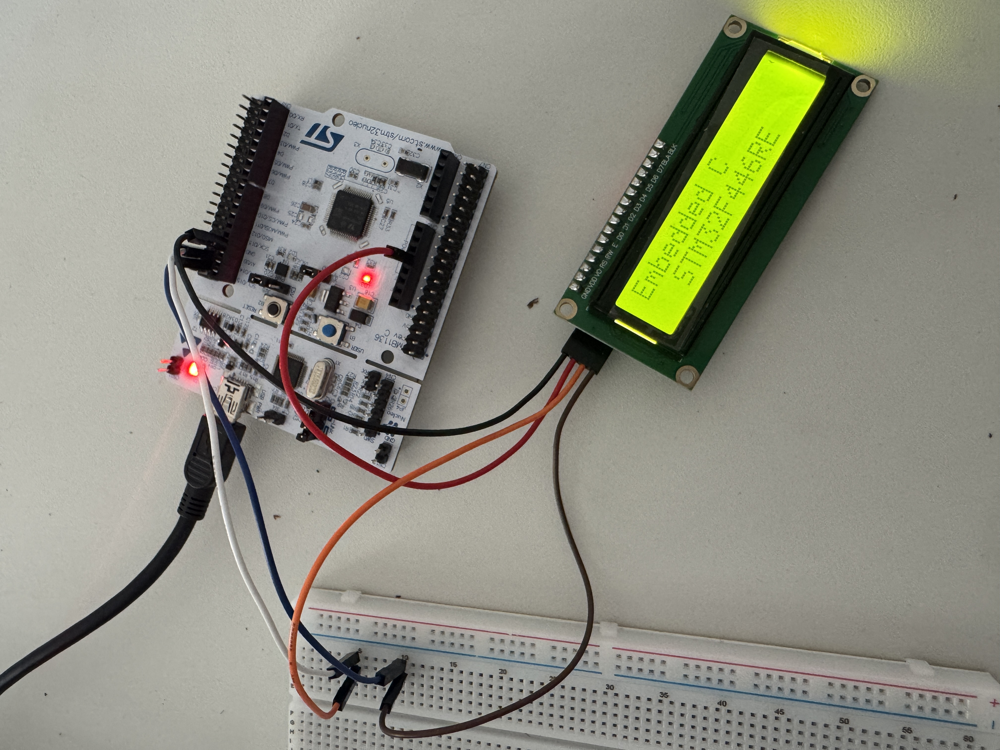

# LCD 1602 I2C Driver — STM32F446RE

Bare-metal driver for controlling an LCD 1602 display over I2C, written entirely in C from scratch without the use of Hardware Abstraction Libraries (HAL) or external dependencies.

This project demonstrates low-level hardware control, datasheet analysis, and direct register manipulation on an ARM Cortex-M4 microcontroller.



---

## Technical Highlights

- Direct register-level configuration of STM32F446RE I2C peripheral
- HD44780 initialization sequence implemented according to datasheet requirements
- Custom I2C transaction layer without HAL drivers
- Modular driver architecture (I2C abstraction + LCD driver)
- Timing-sensitive communication implemented using software delays

---

## Hardware

| Component | Details |
|-----------|---------|
| **MCU** | STM32F446RE (Nucleo-64) |
| **Display** | LCD 1602 with PCF8574 I2C expander |
| **I2C Address** | 0x27 |
| **SCL Pin** | PB8 (Alternate Function 4, Open-Drain) |
| **SDA Pin** | PB9 (Alternate Function 4, Open-Drain) |
| **System Clock** | 16MHz HSI (Default, no PLL) |

---

## Project Structure

```text
├── core/
│   └── Src/
│       └── main.c          # Application entry point
├── Drivers/
│   ├── I2C/
│   │   ├── i2c.c           # I2C1 peripheral initialization & communication
│   │   └── i2c.h
│   └── LCD/
│       ├── lcd_i2c.c       # LCD 1602 driver & HD44780 protocol implementation
│       └── lcd_i2c.h
└── images/
    └── demo.jpg
```

---

## How It Works

The LCD 1602 is connected via a **PCF8574 I/O expander**, which converts serial I2C communication into the parallel interface required by the HD44780 controller.

The driver operates in **4-bit mode**, meaning each byte is sent as two separate nibbles (High then Low), reducing the required GPIO pins from 8 to 4.

### I2C Configuration

| Parameter | Value |
|-----------|-------|
| **Peripheral** | I2C1 |
| **Mode** | Fast Mode |
| **Speed** | ~200kHz |
| **SCL** | PB8 — AF4, Open-Drain |
| **SDA** | PB9 — AF4, Open-Drain |

### LCD Initialization Sequence (HD44780)

1. Wait >40ms after power-on
2. Send reset nibble `0x30` three times to ensure proper state
3. Switch to 4-bit mode (`0x20`)
4. Configure display parameters: 2 lines, 5x8 font
5. Display ON, Cursor OFF
6. Clear display RAM
7. Entry mode: increment cursor from left to right

---

## API

```c
void LCD_Init(void);                          // Initialize the display and I2C setup
void LCD_Clear(void);                         // Clear screen and return home
void LCD_SetCursor(uint8_t row, uint8_t col); // Set cursor position (Row 0-1, Col 0-15)
void LCD_SendString(const char *str);         // Print a null-terminated string
```

---

## Example Output

The following text is displayed on the LCD upon startup:

```
+--------------------+
| Embedded C         |
|   STM32F446RE      |
+--------------------+
```

---

## Future Improvements

To further enhance the robustness and efficiency of this driver, the following improvements are planned:

- **I2C Timeout Mechanism** — Implement timeout counters in the I2C polling loops to prevent hardware deadlocks in the event of a disconnected or malfunctioning I2C bus
- **Hardware Timer Delays** — Replace the software-based delay loop (`__NOP()`) with precise, compiler-independent delays utilizing the ARM Cortex-M SysTick Timer
- **Non-Blocking Communication** — Migrate from blocking polling to an interrupt-driven or DMA-based architecture to free up CPU cycles for application-level tasks

---

## Development Environment

| Tool | Details |
|------|---------|
| **IDE** | STM32CubeIDE |
| **Language** | C (Bare-metal, direct register access) |
| **Target** | STM32F446RE — ARM Cortex-M4 |
| **Programmer** | ST-LINK (On-board) |